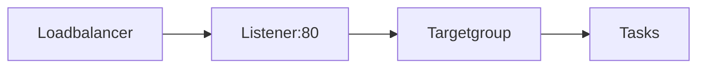

## AWS ECS 를 이용한 docker 서비스
ECS 테스트 후 기록남김.  
[기초](#기초)  
[목표](#목표)  
[docker 이미지 생성](#docker-이미지-생성)  
[클러스터 및 컨테이너 인스턴스 생성](#클러스터-및-컨테이너-인스턴스-생성)  
[서비스와 태스크 디피니션 생성](#서비스와-태스크-디피니션-생성)  
[로드밸런서를 이용한 서비스](#로드밸런서를-이용한-서비스)  


### 기초
클러스터가 있고, 안에 인스턴스가 있음.  
클러스터는 EC2 인스턴스 같은 자원이 아님.  
여기서 EC2나 fargate같은 자원을 연결하여 컨테이너 인스턴스를 만듬.(fargate는 lambda같은 서비스인듯)
인스턴스 안에서 실제로 돌아가는 작업은 태스크라고 함.  
이 태스크를 만들기 위해서는 태스크 디피니션이 필요한데, 말 그대로 태스크를 만들기 위한 정의임.  
태스크 실행시 필요한 각종 인수(네트워크, 도커 이미지, cpu mem 자원 등)를 정의해두고 태스크가 시작되어야 할때 이를 기준으로 태스크가 실행됨.  
특이한 점은 이 태스크 디피니션은 업데이트가 되지 않고 리비전으로 관리됨.(삭제도 되지 않음)
이 태스크는 클러스터 인스턴스에서 직접 실행되는 방법도 있으나^[ECS -> task definition > 작업 > 작업 실행], 일반적으로는 그리 사용하지 않을것 같음.  
서비스를 이용한 방법이 주가 될것 같은데, 서비스는 클러스터 안에서 실행되며, 클러스터 안에 포함된 인스턴스 어디에서나 실행된다.(사용자가 어느 인스턴스에서 실행시키도록 특정하는것은 불가능한듯 함)
타입은 두가지가 있는데, 레플리카와 데몬 타입이다.  
데몬타입은 각 인스턴스에서 한개의 태스크가 실행되는듯 하며(테스트 안해봄), 레플리카에서는 클러스터 인스턴스 안에서 여러개의 태스크가 실행되도록 자동으로 관리해준다. 서비스 정의 시 몇개의 태스크가 실행될지 정해야 한다. 즉 서비스는 태스크 스케쥴링을 담당한다.  

### 목표
LB를 이용하여 80포트로 웹 서비스를 제공한다.  
ECR에 docker이미지를 푸시하여
ECS 클러스터, 서비스를 이용하여 동적으로 포트가 할당된 태스크를 LB와 연결한다.  

### docker 이미지 생성
태스크로 실행될 도커 이미지를 준비하자.  
일단 빌드될 어플리케이션이나 뭔가가 필요한데, 최근에 생성했던 헤로쿠 테스트용 앱을 그대로 사용하였음.  [github 링크](https://github.com/mycode01/herokuapptest)  
dockerfile 을 보면
```
FROM java:8
COPY build/libs/heroku-0.0.1-SNAPSHOT.jar app.jar
EXPOSE 8080
ENTRYPOINT ["java","-Djava.security.egd=file:/dev/./urandom","-Durl.webhook=https://discordapp.com/api/webhooks/","-jar","/app.jar"]
```
로 작성하였음. 간단하게 java:8 을 베이스 이미지로 만들며, 빌드된 heroku-0.0.1-SNAPSHOT.jar 파일을 app.jar파일로 만들어 8080포트를 오픈, `java -Durl.webhook=https://discordapp.com/api/webhooks/ -jar /app.jar`를 실행하는 도커 이미지를 생성하는 dockerfile을 작성함. 
말이 긴데 그냥 보통의 웹서버를 실행하는 도커이미지.  
빌드하기 위해 dockerfile이 있는 위치에서 아래 명령을 실행한다.  
`docker build -t testunit768/ecs:v0.1 .`    
버전으로는 v0.1 처럼 표기하면 보기좋게 하이라이트 시켜주는듯.  
이미지가 잘 생성됐는지 테스트 하기위해 아래를 실행하자.  
```bash
docker run -it -p 8080:8080 testunit768/ecs:v0.1
curl localhost:8080/info 
```
호스트네임이 반환되면 정상, 아니면 dockerfile이나 어플리케이션이 잘못 빌드 돼었을것이다.  
`docker image list`를 쳐보면 방금 빌드 이미지와 그 베이스가 된 이미지를 볼수있다.  

다음으로는 docker 이미지를 저장해 둘 저장소를 생성한다.  
ecs에서는 곧바로 docker이미지를 업로드해서 사용할수 없고, 레파지토리 uri를 통해서 태스크 디피니션을 작성하여 태스크를 생성할수 있다.  
보통 dockerhub에 가입하면 퍼블릭 저장소와 프라이빗 저장소를 제공하는데, 
당연히 배포할 이미지는 프라이빗에 들어가야 할것이다. AWS 에서는 Elastic Container Registry(ECR)을 제공하는데, docker hub같은 레파지토리이다.  
AWS 웹 콘솔 > ECR > 리포지토리 생성 버튼 누르면 간단히 생성됨.  
다만 AWS cli를 활용한 [튜토리얼](https://www.44bits.io/ko/post/container-orchestration-101-with-docker-and-aws-elastic-container-service)을 보면서 따라했기 때문에 그 방법을 사용함.  
```bash
aws ecr create-repository --repository-name <repo-name> \
| jq ".repository | .repositoryUri" 
```
jq는 create-repository 결과값을 파싱해주는 역할을 하며, json 데이터가 날아 올텐데^[아니라면 aws configure 에서 Default output format 을 json으로 바꿔주자] 이 결과 값에서 repository 밑의 repositoryUri 값을 리턴시켜준다.  
즉, repo-name이라는 이름으로 레파지토리를 생성하고, 그 주소를 바로 받아볼수 있게 하는 명령이다.  
생성된 레파지토리는 `aws ecr describe-repositories` 명령으로 다시 볼수 있다.  
해당 Uri는 도커 푸시할때 사용되므로 잠시 킵해두고, 위에서 생성한 도커 이미지의 태그를 바꿔주자.  
`docker tag testunit768/ecs:v0.1 <repo-uri>/<repo-name>:v0.1`
레파지토리 주소는 보통 `1234567890.dkr.ecr.<region>.amazonaws.com/<repo-name>` 로 나오게 되는데, 여기 푸시를 하기위해선 태그를 바꿔줘서 이름을 같게 만들어 줘야하는 모양임.  
그다음은 ECR 서비스에 로그인을 해야하는데, git hub을 사용하기위해서 로그인을 해야하는것 처럼 aws cli와 별도로 사용되는것과 같은 맥락이라고 이해하였음.  
아무튼 `aws ecr get-login --no-include-email`를 입력하면 무언가 결과값을 주는데, 이를 복사해다 다시 터미널에 입력하면 로그인이 가능하다.  
그런데 이렇게 하지 말고, 셸의 기능인 $() 를 사용하면 로그인이 바로 가능하다. `eval ...` 과 같다고 보면 된다. 배포 스크립트 작성시 활용하자.  
`$(aws ecr get-login --no-include-email)`를 입력하면 로그인처리가 완료된다.  

다음은 레파지토리 푸시이다.  
```bash
docker push <repo-uri>/<repo-name>:v0.1
```
을 입력하면 베이스가 되는 이미지들과 함께 업로드가 되는걸 볼수있다.  
푸시작업이 끝나면 
`aws ecr describe-images --repository-name <repo-name>`명령 혹은 AWS 콘솔에서도 확인이 가능하다.  

### 클러스터 및 컨테이너 인스턴스 생성
ECS를 사용하기 위해서 먼저 클러스터를 생성한다.  
위에서 설명했다 시피 클러스터는 컨테이너 인스턴스를 가지며, 그 인스턴스들 사이에서 서비스가 태스크를 실행시키며, 태스크를 실행시키기 위해선 태스크 디피니션이 필요하다.  
ECR과 마찬가지로 클러스터를 생성하기 위해서 AWS 콘솔을 사용가능하지만 aws cli를 이용하겠음.  
`aws ecs create-cluster --cluster-name <cluster-name> | jq '.cluster | .clusterArn'`
으로 클러스터 생성이 완료됨과 동시에 Arn이 반환되니 킵해두자.  
`aws ecs list-cluster` 명령과 웹 콘솔로 생성한 클러스터 리스트를 확인 가능하다.  

현재까지는 단순히 클러스터만 생성하였을 뿐 실제로 태스크가 실행될 인스턴스는 생성되지 않았다.  
웹 콘솔에서 클러스터를 생성하였다면 인스턴스까지 생성이 되었을테지만 cli로 실행하였고, 아직 인스턴스를 할당하지 않은 상태이므로 vpc와 sg^[security group]를 함께 지정하여 인스턴스를 할당한다.  

시큐리티 그룹을 생성한다. 서비스 될 포트를 열어주면 되므로 기존에 사용중인것이 있다면 그냥 사용한다.  
```bash
aws ec2 create-security-group --group-name <group-name> --description description --vpc-id <vpc-id>
```
위 명령을 사용하면 sg를 생성해 그룹아이디를 돌려준다. 킵해두자.  
vpc는 기본적으로 생성된것을 사용하자. vpc-id를 모른다면 `aws ec2 describe-vpcs | jq '.Vpcs[] | .VpcId'` 으로 조회한다.  

위에서는 그냥 sg를 생성만 했을뿐 인바운드 룰을 정의하지 않았다.  
```bash
aws ec2 authorize-security-group-ingress \
--group-id <sg-group-id> --protocol tcp --port 80 --cidr 0.0.0.0/0
```
위에서 생성한 도커이미지가 8080을 오픈하지만, 우리는 80포트를 이용하여 ecs에 접속을 테스트 하기 위해 80을 0.0.0.0/0에게 오픈하는 룰을 생성했다.  

다음은 컨테이너 인스턴스로 사용될 인스턴스를 생성한다.  
ec2 인스턴스를 생성할때, AMI를 지정해야하는데, ecs에 최적화된 이미지를 이미 AWS에서 제공중이다. [리스트](https://docs.aws.amazon.com/AmazonECS/latest/developerguide/ecs-optimized_AMI.html) 를 보고 해당 ami-id를 가져와 이용하자.  
여러개의 터미널을 이용하면 편하다.  
아래의 설명을 보고 명령을 사용하여 인스턴스를 생성하자.  
```bash
aws ec2 run-instances --image-id <optimized-ami-id> --count 2 --instance-type t2.small \
--security-group-ids <sg-group-id> <sg-group-id-default> \
--subnet-id <subnet-id> --iam-instance-profile Name=<iam-role> \
--associate-public-ip-address \
--user-data file://userdata.sh
```
옵션이 좀 많지만 풀어서 설명함.  
optimized-ami-id는 위에서 설명한 최적화 이미지 ami-id가 되며, 
count는 생성할 인스턴스 갯수, instance-type은 인스턴스의 타입(종류),
security-group-ids 는 위에서 생성한 시큐리티 그룹과 vpc 기본 sg의 id를 입력한다. vpc 기본 sg를 제외하면 504에러가 발생함. id를 모른다면 
```bash
aws ec2 describe-security-groups |jq '.SecurityGroups[] | .GroupName , .GroupId'
``` 를 이용하여 groupname과 groupId를 매칭해서 입력해주자.  
subnet-id는 생성할 인스턴스가 존재할 서브넷의 위치를 지정해준다. 
현재 사용중인 vpc가 기본 제공 vpc이외에 없다면 빼버려도 된다.  
subnet은 vpc안에 속하게 되므로 우리가 사용할 기본 vpc안에 속한 subnet을 선택해주자. id를 모른다면
```bash
aws ec2 describe-subnets |jq '.Subnets[] | select(.VpcId=="<vpc-id>") | .SubnetId'
```
아마 기본 3개의 서브넷이 나올텐데, 아무거나 선택하면 된다.  

iam-instance-profile은 생성될 인스턴스의 롤을 정한다. 
iam에 가서 롤을 만들어주자. IAM > 역할 > 역할만들기 > ec2 > AmazonEC2ContainerServiceforEC2Role 선택 및 생성
롤을 만들었으면 해당 이름을 iam-role 에 입력해준다.  

associated-public-ip-address 는 인스턴스에 각 퍼블릭으로 연결된 ip를 할당하느냐에 대한 플래그이다.  

user-data는 인스턴스가 실행될때 같이 실행될 쉘파일을 설정한다.  
앞서 설명하지 않았지만, 컨테이너 인스턴스로 만들어질 인스턴스를 생성할때, 이 인스턴스가 어떤 클러스터에 속할 인스턴스인지는 정해야 하는데, 그 방법이 이부분이다.  
쉘 파일을 작성한다.  
```bash
#!/bin/bash
echo ECS_CLUSTER=<cluster-name> >> /etc/ecs/ecs.config
```
cluster-name에 위에서 생성한 클러스터 이름을 입력하고 저장한 후, 위의 user-data에 인수로 넘겨준다.  

여기까지하면 클러스터와 컨테이너 인스턴스가 생성되며, ec2 인스턴스가 생성이 완료되면 웹 콘솔의 ECS에서 클러스터와 컨테이너 인스턴스를 확인할수있다.  
혹은, `aws ecs describe-clusters --cluster <cluster-name>` 으로 확인할수 있다.  


### 서비스와 태스크 디피니션 생성
이제 태스크가 실행될 클러스터와 인스턴스를 생성하였으니 실제 작업이 정의된 태스크 디피니션^[작업 정의]와 이를 스케쥴링 해줄 서비스를 생성해보자.  
사실 서비스는 태스크 디피니션을 포함하는 개념으로 태스크 디피니션을 먼저 생성해야 서비스를 생성할수 있다. 이는 웹 콘솔에서 서비스를 생성해도 마찬가지이다.  
태스크 디피니션을 생성할 json 파일을 생성한다.  
```json
{
  "family": "<task-definition-family-name>",
  "networkMode": "bridge",
  "containerDefinitions": [
    {
      "name": "<task-definition-name>",
      "essential": true,
      "image": "<repo-uri>/<repo-name>:v0.1",
      "cpu": 0,
      "memory": 128,
      "portMappings": [
        {
          "hostPort": 0,
          "containerPort": 8080,
          "protocol": "tcp"
        }
      ]
    }
  ]
}
```
task-definition-family-name 에는 태스크 디피니션 명을 사용한다.  
td는 리비전으로 관리되기때문에 이를 묶어서 부를 수있는 이름을 사용한다.  
서비스를 생성할때 이를 이용하여 생성하기 때문에 킵해두자.  
containerDefinitions에 실제 컨테이너에서 실행될 태스크의 정보를 입력한다.  
image에는 위에서 푸시한 ecr의 uri를 입력한다.  
portMappings 의 hostPort는 도커 실행시의 -p 8080:8080과 같다.  
하지만 우리는 컨테이너에서 여러대의 태스크가 동작하여야 하므로, 8080포트를 점유시킬수 없기에 portMappings.hostPort를 0으로 설정하여 ecs가 자동으로 관리하게 만들어 준다.  

<details close>
  <summary>cloudwatch 에서 로그 확인 </summary>
  containerDefinitions.logConfiguration은 cloudWatch와 연결하여 스트림그룹을 생성할때 사용하는 옵션이다.  
  이를 이용하여 로그를 확인할수있다. 단 미리 로그 그룹이 생성되어 있지 않으면 태스크 실행이 실패된다.  
  "logConfiguration": {
    "logDriver": "awslogs",
    "options": {
        "awslogs-group": "/ecs/td-testunit",
        "awslogs-region": "ap-northeast-2",
        "awslogs-stream-prefix": "ecs"
      }
  }
</details>


파일을 저장하고 실제 생성한다.  
```bash
aws ecs register-task-definition --cli-input-json file://<td-file-name> \
| jq '.taskDefinition | .taskDefinitionArn'
```
file-name은 위에 생성한 json 파일을 입력한다. 정상적으로 완료된다면 태스크 디피니션의 arn이 반환된다.  

`aws ecs describe-task-definition --task-definition <task-definition-family-name>`
으로 생성된 태스크 디피니션을 확인가능하다.  

서비스 정의도 json으로 저장하자.  
```json
{
    "serviceName": "<service-name>",
    "taskDefinition": "<task-definition-family-name>:1",
    "desiredCount": 10
}
```
service-name은 클러스터에서 참조할 서비스이름,
task-definition-family-name은 위에서 작성한 family-name을 입력한다.  
위에서 설명했다시피 td는 리비전으로 관리되기때문에 :1 이 해당 리비전 1번을 의미한다.  
막 생성한 리비전은 1밖에 없을것이므로 1로 입력.  
desiredCount 는 실행될 태스크 갯수(원하는 개수)이다.  
위에서 hostPort를 0으로 설정하였으니 포트충돌은 발생하지 않는다.  

저장한 json 파일을 이용하여 서비스를 생성한다.  
```bash
aws ecs create-service --cluster=<cluster-name> --cli-input-json file://<service-file-name>
```
잠시 후 웹 콘솔을 확인하면 태스크 디피니션에 작성된 레파지토리의 이미지를 가져다 서비스를 만들고, 태스크가 실행됨을 확인할수 있다. 혹은 
`aws ecs describe-clusters --cluster <cluster-name> |jq '.clusters[] | .runningTasksCount'` 명령으로 태스크가 실행중임을 확인할수 있다.  

ECS > 클러스터 선택 > 서비스 선택 > 작업 탭에서 실행중인 태스크를 확인 가능하고,
문제가 생겼다면 태스크 생성을 반복하고 있을텐데, 바로 옆 탭인 이벤트 탭을 보면 무슨일이 일어나고 있는지 확인가능하며, 태스크 id 링크를 따라가면 로그도 확인 가능하다.  

태스크를 실행하였으나 현재로는 ecs가 자동으로 생성한 30000번 이상의 포트를 이용하여 접속할수 없다.  
sg에서 허용해주지 않았기때문이며, 실제로 sg에서 30000이상포트 인바운드 룰을 생성하면 테스트가 가능하다.

아직 로드밸런스를 생성하여 80포트를 이용하여 접속을 가능케 하는 설정이 되어있지 않다.  

### 로드밸런서를 이용한 서비스
우리의 목표는 80포트를 이용하여 여러대의 인스턴스(혹은 태스크)를 이용한 웹 서비스 생성이므로
하나의 인스턴스에 하나의 태스크만 작동하는걸 원하지 않을 것이다.  
현재까지 여러대의 인스턴스를 생성하였으므로 그것을 로드밸런서와 타깃 그룹으로 묶어보자.  

먼저 로드밸런서를 연결하기 위해서 타깃그룹을 생성해야함.  
```bash
aws elbv2 create-target-group --name <target-group-name> \
--protocol HTTP --port 8080 --vpc-id <vpc-id> \
 | jq '.TargetGroups[0] | .TargetGroupArn'
```
vpc-id를 모른다면 `aws ec2 describe-vpcs | jq '.Vpcs[] | .VpcId'`

port는 8080으로 사용하였지만 실제로 타깃그룹과 ecs가 연결되면 해당 설정과 무관하게 태스크로 연결이 된다.  

다음은 로드밸런서를 생성한다.  
```bash
aws elbv2 create-load-balancer --name <load-balancer-name> \
--subnets <subnet-id> <subnet-id> <subnet-id> \
--security-groups <sg-group-id> <sg-group-id-default> \
| jq '.LoadBalancers[0] | .LoadBalancerArn'
```
로드밸런서, 타겟그룹, 목적 인스턴스는 모두 같은 vpc에 있어야 하며, sg의 설정은 외부 네트워크망에서 접근 가능하도록 해야함.(테스트를 할거라면)
로드밸런서는 로드를 분배하는 목적이 있기때문에 2개이상의 서브넷을 지정해야한다.  
기본 제공되는 vpc의 서브넷은 3개이다. 하지만 우리는 2개의 ec2 인스턴스를 생성하였기 때문에 최소 하나의 subnet은 비어있을 것이다.  
이 경우 그냥 비어있는 서브넷을 입력해도 영향은 없다. 서브넷을 잊어버렸다면 다음을 입력하여 확인한다.  
```bash
aws ec2 describe-subnets |jq '.Subnets[] | select(.VpcId=="<vpc-id>") | .SubnetId'
```
sg를 잊어버렸다면 다음을 입력하여 확인한다.  
```
aws ec2 describe-security-groups |jq '.SecurityGroups[] | .GroupName , .GroupId'
```

다음은 로드밸런서에서 사용할 리스너를 생성한다.  
```bash
aws elbv2 create-listener --protocol HTTP --port 80 \
--load-balancer-arn='<load-balancer-arn>' \
--default-actions 'Type=forward,TargetGroupArn=<target-group-arn>'
```
80으로 리슨된 트래픽을 타겟그룹으로 보내는 역할을 한다.  
지금까지 생성된 태스크들은 ecs에의해 30000번이상의 랜덤한 포트를 사용하고 있는데, 리스너는 일단 80을 listen하고,
default-action설정에 의해서 80으로 들어온 트래픽을 타겟그룹으로 포워딩한다.  

로드밸런서의 arn을 잊어버렸다면 
```bash
aws elbv2 describe-load-balancers | jq '.LoadBalancers[0] | .LoadBalancerArn'
```
혹시나 사용중인 로드밸런서가 있다면 사용중인 로드밸런서와 엮이지 않도록 주의한다.  

타겟그룹의 arn을 잊어버렸다면
```bash
aws elbv2 describe-target-groups | jq '.TargetGroups[] | .TargetGroupArn'
```

여기까지 로드밸런서와 리스너, 대상그룹이 연결되었지만 실제로 대상그룹은 서비스에는 연결되어있지 않음.  
서비스가 대상그룹을 리슨하고있지 않기때문에.  
서비스를 대상그룹에 연결시키기 위해 서비스를 다시 만든다. 서비스 설정변경으로는 로드 밸런서를 연결시킬수 없음.  
```bash
aws ecs update-service --cluster=<cluster-name> --service=<service-name> --desired-count=0
aws ecs delete-service --cluster=<cluster-name> --service=<service-name>
```
인스턴스의 태스크를 일단 없앤다음 서비스를 삭제한다.  
서비스 json 파일을 작성한다. 아까 위에서 작성했던 파일에서 role과 loadBalancers 부분을 추가하자.  
```json
{
    "serviceName": "<service-name>",
    "taskDefinition": "<task-definition-family-name>:1",
    "desiredCount": 10,
    "role": "<iam-arn-AWSServiceRoleForECS>",
    "loadBalancers": [
      {
        "targetGroupArn": "<target-group-arn>",
        "containerName": "<task-definition-name>",
        "containerPort":8080
      }]
}
```
iam-arn-AWSServiceRoleForECS 는 아마 자동생성 되어있을것이므로 해당 arn을 복사해 넣는다.  
```bash
aws iam list-roles | jq '.Roles[] | select(.RoleName=="AWSServiceRoleForECS")| .Arn'
```
task-definition-family-name과 task-definition-name을 햇갈리지 않도록 한다.  
타겟그룹의 arn을 잊어버렸다면
```bash
aws elbv2 describe-target-groups | jq '.TargetGroups[] | .TargetGroupArn'
```
desiredCount로 화끈하게 10개 줘서 테스트를 해보자.  

실제 서비스를 생성한다.  
```bash
aws ecs create-service --cluster=<cluster-name> --cli-input-json file://<service-filename-2>
```

잠시후 타겟그룹에 10개의 인스턴스(태스크)가 붙음을 확인 가능하며, 로드발란서의 dns로 접속해보면 직전의 테스트와 다르게 호스트네임이 바뀌는것을 확인 가능함.  

로드밸런서의 리스너가 http 80포트에 트래픽을 받게되면 타겟그룹에 등록된 인스턴스, 여기서는 각 태스크에게 트래픽이 전달되는데, 특이하게 ecs에 등록된 태스크의 포트에 따라 전달이 됨.  
대상그룹에 8080포트를 주었지만 실제로는 무시되며, 리스너가 직접 ecs의 태스크에 붙어있는듯한 착각을 하게끔 설정이 됨.  
웹 콘솔의 대상그룹의 대상 탭을 보면 등록된 태스크들이 보일텐데, 해당 인스턴스들의 포트와 맞지 않음에도 불구하고 트래픽이 전달됨을 확인가능함.  

이제 로드밸런서의 dns로 접속해보면 호스트명이 10개가 교차되는것을 확인가능하다.  
태스크 각각이 호스트명이 다르기 때문에.  

여기까지 수행하였다면 다음과 같은 그림이 그려진다.  



많은 참고 : https://www.44bits.io/ko/post/container-orchestration-101-with-docker-and-aws-elastic-container-service

thanks a million for [nacyot](https://keybase.io/nacyot/)


